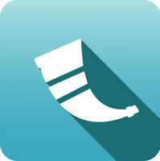

## Sobre mim
- 💭 Desenvolvedor Backend
- 🎓 Bacharel em Sistemas de Informação pelo IFSC
- 🐍 Trabalho com Python, seus frameworks e bibliotecas (Flask, Django, FastAPI)
- 📚 Me especializando no MBA Arquitetura Fullcycle
- 🧑‍💻 Desenvolvendo para web com o Filipe Deschamps no curso.dev
- 📩 Entre em contato, gosto de conhecer pessoas novas e participar de projetos

---

    
    
    
    
    
    
    

---
